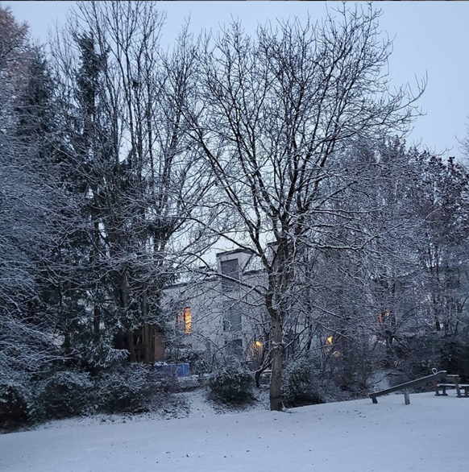
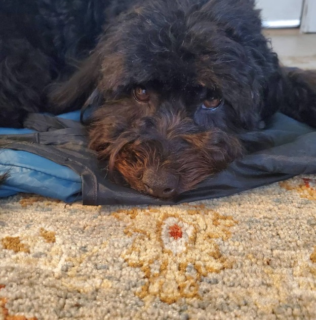
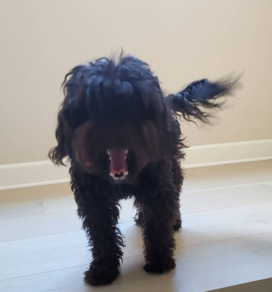
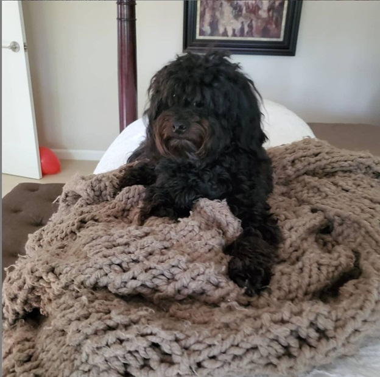

# First snow! 

I took this picture walking in our front yard and it seemed like such a beautiful composition of light from the sun, warm light from the houses around me and the stark contrast of these. Right before school I walked outside and I saw that it snowed!! Is was so pretty and I thought I must take a photo. The photo turned out much prettier and cooler than I thought. I hope you like it too. 

# Fritzy with Shopping bags!!!!

This photo is one of my favorite photos of Fritzy! He was laying on some shopping bags and I thought it would be a cute picture of him so i took it! My favorite part of this picture was Fritzy's moustache. I think the colors are so vibrant and they look very good.🐶🐶🐶  

# Good mornin' Fritzy

Good morning Fritzy! How did you sleep? This is a photo of Fritzy in the morning right after he woke up! He was walking down the stairs and I took the picture right in time when he was yawning! Its a little blurry but I hope you still like it ╰(*°▽°*)╯

# King of the bed!!!

Fritzy really likes this blanket! Every night he sleeps on it and he absolutely l💖ves it. I thought it looked funny but very kingly in Fritzy's perspective! I also thought that the blanket matched him in a way because he is black but has a tint of brown to him! I also really like this photo because he is looking straight at the camera in a very serious way! 💙
